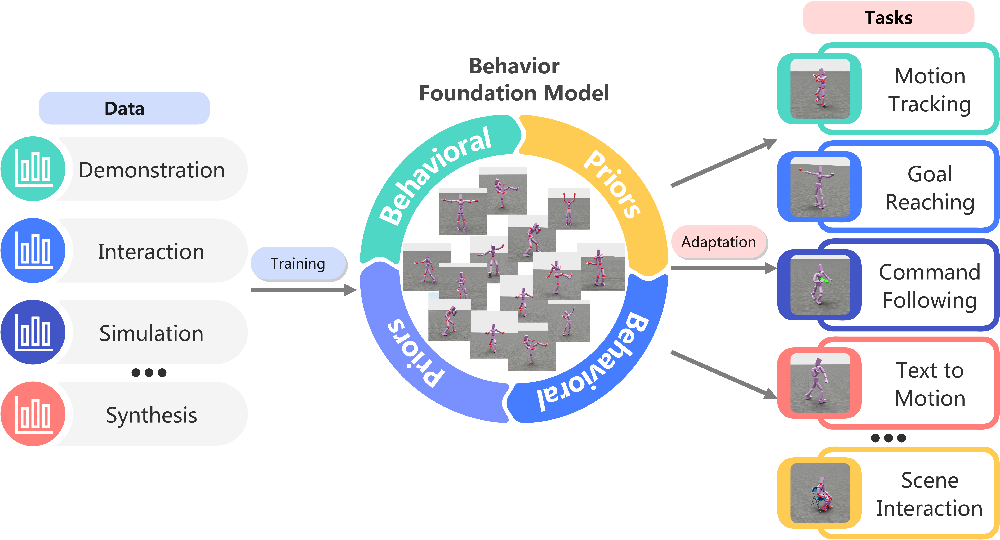

# Awesome-BFM-Papers

[](https://github.com/yuanmingqi/awesome-bfm-papers) 

A curated list of behavior(al) foundation model (BFM) papers, articles, tutorials, slides, and projects.

# Table of Contents
- [What is the Behavior Foundation Model?](#what-is-the-behavior-foundation-model)
- [Paper List](#paper-list)
  - [Pre-training](#pre-training)
    - [Forward-backward Representation Learning](#forward-backward-representation-learning)
    - [Goal-conditioned Learning](#goal-conditioned-learning)
    - [Intrinsic Reward-driven Learning](#intrinsic-reward-driven-learning)
  - [Adaptation](#adaptation)
    - [Fine-tuning Techniques](#fine-tuning-techniques)
    - [Towards Hierarchical Control](#towards-hierarchical-control)
- [Cite Us](#cite-us)


# What is the Behavior Foundation Model?

<div align=center>
<br>

<br>
</div>

A behavior foundation model learns **broad behavior priors** from **large-scale and diverse behavior data**, which can then be conveniently adapted to a wide range of downstream tasks.

# Paper List

## Pre-training

### Forward-backward Representation Learning

| 📅Year 	|   🗃️Archive  	|                                          🔤Title                                         	|                   📜Paper                  	|   🖥️Code  	|
|:-----:	|:-----------:	|:---------------------------------------------------------------------------------------:	|:-----------------------------------------:	|:--------:	|
|  2025 	|   **ICLR**  	|          Zero-shot Whole-body Humanoid Control via Behavioral Foundation Models         	|                 [Paper]()                 	| [Code]() 	|
|  2024 	|  **arXiv**  	| Finer Behavioral Foundation Models via Auto-regressive Features and Advantage Weighting 	| [Paper](https://arxiv.org/abs/2412.04368) 	| [Code]() 	|
|  2023 	| **NeurIPS** 	|                      Fast Imitation via Behavior Foundation Models                      	|                 [Paper]()                 	| [Code]() 	|

### Goal-conditioned Learning


| 📅Year 	|       🗃️Archive       	|                                            🔤Title                                            	|                   📜Paper                  	|   🖥️Code  	|
|:-----:	|:--------------------:	|:--------------------------------------------------------------------------------------------:	|:-----------------------------------------:	|:--------:	|
|  2025 	|       **ICRA**       	|               HOVER: Versatile Neural Whole-Body Controller for Humanoid Robots              	|                 [Paper]()                 	| [Code]() 	|
|  2025 	|       **CVPR**       	| InterMimic: Towards Universal Whole-Body Control for Physics-Based Human-Object Interactions 	|                 [Paper]()                 	| [Code]() 	|
|  2025 	|       **arXiv**      	|                       ModSkill: Physical Character Skill Modularization                      	| [Paper](https://arxiv.org/abs/2502.14140) 	| [Code]() 	|
|  2024 	|        **TOG**       	|     MaskedMimic: Unified Physics-Based Character Control Through Masked Motion Inpainting    	|                 [Paper]()                 	| [Code]() 	|
|  2024 	|        **TOG**       	|      MoConVQ: Unified Physics-Based Motion Control via Scalable Discrete Representations     	|                 [Paper]()                 	| [Code]() 	|
|  2024 	|     **SIGGRAPH**     	|         CALM: Conditional Adversarial Latent Models for Directable Virtual Characters        	|                 [Paper]()                 	| [Code]() 	|
|  2024 	|   **SIGGRAPH Asia**  	|     CASE: Learning Conditional Adversarial Skill Embeddings for Physics-Based Characters     	|                 [Paper]()                 	| [Code]() 	|
|  2024 	|       **ICCV**       	|                PHC: Perpetual Humanoid Control for Real-Time Simulated Avatars               	|                 [Paper]()                 	| [Code]() 	|
|  2023 	| **Science Robotics** 	|           TeamPlay: From Motor Control to Team Play in Simulated Humanoid Football           	|                 [Paper]()                 	| [Code]() 	|
|  2023 	|       **ICML**       	|           MTM: Masked Trajectory Models for Prediction, Representation, and Control          	|                 [Paper]()                 	| [Code]() 	|
|  2022 	|        **TOG**       	|  ASE: Large-scale Reusable Adversarial Skill Embeddings for Physically Simulated Characters  	|                 [Paper]()                 	| [Code]() 	|


### Intrinsic Reward-driven Learning

| 📅Year 	| 🗃️Archive 	|                                   🔤Title                                  	|                   📜Paper                  	|   🖥️Code  	|
|:-----:	|:--------:	|:-------------------------------------------------------------------------:	|:-----------------------------------------:	|:--------:	|
|  2021 	| **ICML** 	|                 Active Pretraining with Successor Features                	| [Paper](https://arxiv.org/abs/2106.14910) 	| [Code]() 	|
|  2021 	| **ICML** 	|          Reinforcement Learning with Prototypical Representations         	| [Paper](https://arxiv.org/abs/2103.01975) 	| [Code]() 	|
|  2020 	| **ICML** 	| State Entropy Maximization with Random Encoders for Efficient Exploration 	| [Paper](https://arxiv.org/abs/2102.05561) 	| [Code]() 	|
|  2019 	| **ICLR** 	|                 Exploration by Random Network Distillation                	| [Paper](https://arxiv.org/abs/1810.12894) 	| [Code]() 	|
|  2019 	| **ICLR** 	|    Diversity is All You Need: Learning Skills without a Reward Function   	| [Paper](https://arxiv.org/abs/1802.06070) 	| [Code]() 	|

## Adaptation
### Fine-tuning Techniques


| 📅Year 	|  🗃️Archive 	|                                  🔤Title                                 	|   📜Paper  	|   🖥️Code  	|
|:-----:	|:---------:	|:-----------------------------------------------------------------------:	|:---------:	|:--------:	|
|  2025 	| **arXiv** 	| Task tokens: A flexible approach to adapting behavior foundation models 	| [Paper]() 	| [Code]() 	|
|  2025 	| **arXiv** 	| Zero-shot adaptation of behavioral foundation models to unseen dynamics 	| [Paper]() 	| [Code]() 	|
|  2025 	|  **CoRL** 	|            Fast adaptation with behavioral foundation models            	| [Paper]() 	| [Code]() 	|

### Towards Hierarchical Control

| 📅Year 	|  🗃️Archive 	|                                                🔤Title                                               	|   📜Paper  	|   🖥️Code  	|
|:-----:	|:---------:	|:---------------------------------------------------------------------------------------------------:	|:---------:	|:--------:	|
|  2025 	| **arXiv** 	|             Leverb: Humanoid whole-body control with latent vision-language instruction             	| [Paper]() 	| [Code]() 	|
|  2025 	| **arXiv** 	|            Langwbc: Language-directed humanoid whole-body control via end-to-end learning           	| [Paper]() 	| [Code]() 	|
|  2025 	| **arXiv** 	|      Tokenhsi: Unified synthesis of physical human-scene interactions through task tokenization     	| [Paper]() 	| [Code]() 	|
|  2025 	|  **ICLR** 	|      Closd: Closing the loop between simulation and diffusion for multi-task character control      	| [Paper]() 	| [Code]() 	|
|  2024 	|  **ICLR** 	|                    Unified human-scene interaction via prompted chain-of-contacts                   	| [Paper]() 	| [Code]() 	|
|  2024 	| **arXiv** 	| UniPhys: Unified planner and controller with diffusion for flexible physics-based character control 	| [Paper]() 	| [Code]() 	|


# Cite Us
If this project helped your work, please cite us by
``` bib
@article{yuan2025bfm,
    title={Behavior Foundation Model: Towards Next-Generation Whole-Body Control System of Humanoid Robots},
    author={Yuan, Mingqi and Yu, Tao and Ge, Wenqi and Yao, Xiuyong and Li, Dapeng and Wang, Huijiang and Chen, Jiayu and Jin, Xin and Li, Bo and Chen, Hua and Zhang, Wei and Zeng, Wenjun},
    journal={arXiv preprint arXiv:2506.20487},
    year={2025}
}
```
