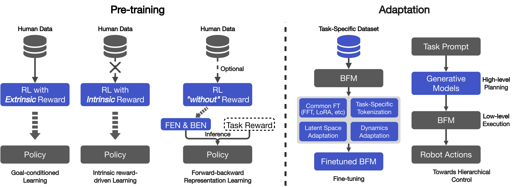

# Awesome-BFM-Papers

[](https://github.com/yuanmingqi/awesome-bfm-papers) <a href="https://arxiv.org/pdf/2506.20487"></a> 

A curated list of behavior(al) foundation model (BFM) papers, articles, tutorials, slides, and projects.

# Table of Contents
- [Awesome-BFM-Papers](#awesome-bfm-papers)
- [Table of Contents](#table-of-contents)
- [What is the Behavior Foundation Model?](#what-is-the-behavior-foundation-model)
- [Paper List](#paper-list)
  - [Pre-training](#pre-training)
    - [Forward-backward Representation Learning](#forward-backward-representation-learning)
    - [Goal-conditioned Learning](#goal-conditioned-learning)
    - [Intrinsic Reward-driven Learning](#intrinsic-reward-driven-learning)
  - [Adaptation](#adaptation)
    - [Fine-tuning Techniques](#fine-tuning-techniques)
    - [Towards Hierarchical Control](#towards-hierarchical-control)
- [Datasets](#datasets)
- [Cite Us](#cite-us)


# What is the Behavior Foundation Model?

<div align=center>
<br>

<br>
</div>

A behavior foundation model learns **broad behavior priors** from **large-scale and diverse behavior data**, which can then be conveniently adapted to a wide range of downstream tasks.

# Paper List

An overview of the pre-training pipelines and adaptation strategies for BFMs discussed in this review. The goal-conditioned learning requires an **extrinsic reward** function and large-scale human data, while intrinsic reward-driven learning uses **intrinsic rewards** generated by self-supervised tasks. In contrast, the forward-backward representation learning learns a forward embedding network (FEN) and a backward embedding network (BEN) using **reward-free** transitions, which can then be combined with a specific reward function to infer a policy. For adaptation strategies, BFMs can be fine-tuned through common approaches, such as full fine-tuning (FFT) and low-rank adaptation (LoRA), as well as methods like latent space adaptation, which adjust the policy by modifying the latent task vector. Beyond fine-tuning, adaptation also involves strategies for hierarchical control, where high-level planners (\textit{e.g.}, generative models like LLMs or diffusion models) process abstract goals and generate subtasks for the BFM to execute as a low-level controller, enabling complex and long-horizon task completion.

<div align=center>
<br>

<br>
</div>

## Pre-training

### Forward-backward Representation Learning

| 📅Year 	|   🗃️Archive  	|                                          🔤Title                                         	|                   📜Paper                  	|🖥️Code  	|
|:-----:	|:-----------:	|:---------------------------------------------------------------------------------------:	|:-----------------------------------------:	|:--------:	|
|  2025 	|   **arXiv**  	|           BFM-Zero: Promptable Behavioral Foundation Model for Humanoid Control Using Unsupervised Reinforcement Learning        	|                 [Paper](https://arxiv.org/abs/2511.04131)                 	| [Code](https://github.com/LeCAR-Lab/BFM-Zero) 	|
|  2025 	|   **ICLR**  	|          Zero-shot Whole-body Humanoid Control via Behavioral Foundation Models         	|                 [Paper](https://arxiv.org/abs/2504.11054)                 	| [Code](https://github.com/facebookresearch/metamotivo) 	|
|  2024 	|  **arXiv**  	| Finer Behavioral Foundation Models via Auto-regressive Features and Advantage Weighting 	| [Paper](https://arxiv.org/abs/2412.04368) 	| N/A 	|
|  2024 	| **NeurIPS** 	|                      Fast Imitation via Behavior Foundation Models                      	|                 [Paper](https://openreview.net/pdf?id=qnWtw3l0jb)                 	| N/A 	|
|  2021 	| **NeurIPS** 	|                      Learning One Representation to Optimize All Rewards |  [Paper](https://proceedings.neurips.cc/paper_files/paper/2021/file/003dd617c12d444ff9c80f717c3fa982-Paper.pdf)                 	| [Code](https://github.com/ahmed-touati/controllable_agent) 	|
|2021|  **arXiv** |Learning Successor States and Goal-Dependent Values: A Mathematical Viewpoint|                 [Paper](https://arxiv.org/pdf/2101.07123)                 	| N/A 	|

### Goal-conditioned Learning


| 📅Year 	|   🗃️Archive  	|                                          🔤Title                                         	|                   📜Paper                  	|🖥️Code  	|
|:-----:	|:--------------------:	|:--------------------------------------------------------------------------------------------:	|:-----------------------------------------:	|:--------:	|
|  2025 	|       **arXiv**      	|                      Sonic: Supersizing Motion Tracking for Natural Humanoid Whole-Body Control                      	| [Paper](https://arxiv.org/abs/2511.07820) 	| [Code](https://nvlabs.github.io/SONIC/) 	|
|  2025 	|       **arXiv**      	|                      Track Any Motions under Any Disturbances                      	| [Paper](https://arxiv.org/abs/2509.13833) 	| [Code](https://github.com/GalaxyGeneralRobotics/OpenTrack) 	|
|  2025 	|       **arXiv**      	|                      Agility Meets Stability: Versatile Humanoid Control with Heterogeneous Data                      	| [Paper](https://arxiv.org/abs/2511.17373) 	| [Code](https://github.com/OpenDriveLab/AMS) 	|
|  2025 	|       **arXiv**      	|                      TWIST2: Scalable, Portable, and Holistic Humanoid Data Collection System                      	| [Paper](https://arxiv.org/abs/2505.02833) 	| [Code](https://github.com/amazon-far/TWIST2) 	|
|  2025 	|       **CoRL**      	|                      TWIST: Teleoperated Whole-Body Imitation System                      	| [Paper](https://arxiv.org/abs/2505.02833) 	| [Code](https://github.com/YanjieZe/TWIST) 	|
|  2025 	|       **CoRL**      	|                       CLONE: Closed-Loop Whole-Body Humanoid Teleoperation for Long-Horizon Tasks                      	| [Paper](https://proceedings.mlr.press/v305/li25h.html) 	| [Code](https://github.com/humanoid-clone/CLONE/) 	|
|  2025 	|       **arXiv**      	|                       Behavior Foundation Model for Humanoid Robots                      	| [Paper](https://arxiv.org/pdf/2509.13780) 	| [Code](https://bfm4humanoid.github.io/) 	|
|  2025 	|       **ICRA**       	|               HOVER: Versatile Neural Whole-Body Controller for Humanoid Robots              	|                 [Paper](https://arxiv.org/abs/2410.21229)                 	| [Code](https://github.com/NVlabs/HOVER/) 	|
|  2025 	|       **CVPR**       	| InterMimic: Towards Universal Whole-Body Control for Physics-Based Human-Object Interactions 	|                 [Paper](https://arxiv.org/abs/2502.20390)                 	| [Code](https://github.com/Sirui-Xu/InterMimic) 	|
|  2025 	|       **arXiv**      	|                       ModSkill: Physical Character Skill Modularization                      	| [Paper](https://arxiv.org/abs/2502.14140) 	| [Code]() 	|
|  2024 	|        **TOG**       	|     MaskedMimic: Unified Physics-Based Character Control Through Masked Motion Inpainting    	|                 [Paper](https://research.nvidia.com/labs/par/maskedmimic/assets/SIGGRAPHAsia2024_MaskedMimic.pdf)                 	| [Code](https://github.com/NVlabs/ProtoMotions) 	|
|  2024 	|     **ICLR**     	|         H-GAP: Humanoid Control with a Generalist Planner        	|                 [Paper]([https://research.nvidia.com/labs/par/calm/assets/SIGGRAPH2023_CALM.pdf](https://arxiv.org/abs/2312.02682))                 	| [Code](https://github.com/facebookresearch/hgap) 	|
|  2024 	|     **SIGGRAPH**     	|         CALM: Conditional Adversarial Latent Models for Directable Virtual Characters        	|                 [Paper](https://research.nvidia.com/labs/par/calm/assets/SIGGRAPH2023_CALM.pdf)                 	| [Code](https://github.com/NVlabs/CALM) 	|
|  2023 	|        **TOG**       	|      MoConVQ: Unified Physics-Based Motion Control via Scalable Discrete Representations     	|                 [Paper](https://arxiv.org/pdf/2310.10198)                 	| N/A 	|
|  2023 	|   **SIGGRAPH Asia**  	|     CASE: Learning Conditional Adversarial Skill Embeddings for Physics-Based Characters     	|                 [Paper](https://arxiv.org/abs/2309.11351)                 	| [Code](https://github.com/Frank-ZY-Dou/CASE) 	|
|  2023 	|       **ICCV**       	|                PHC: Perpetual Humanoid Control for Real-Time Simulated Avatars               	|                 [Paper](https://arxiv.org/abs/2305.06456)                 	| [Code](https://github.com/ZhengyiLuo/PHC) 	|
|  2021 	| **Science Robotics** 	|           TeamPlay: From Motor Control to Team Play in Simulated Humanoid Football           	|                 [Paper](https://arxiv.org/abs/2105.12196)                 	| N/A	|
|  2023 	|       **ICML**       	|           MTM: Masked Trajectory Models for Prediction, Representation, and Control          	|                 [Paper](https://arxiv.org/abs/2305.02968)                 	| [Code](https://github.com/facebookresearch/mtm) 	|
|  2022 	|        **TOG**       	|  ASE: Large-scale Reusable Adversarial Skill Embeddings for Physically Simulated Characters  	|                 [Paper](https://arxiv.org/abs/2205.01906)                 	| [Code](https://github.com/nv-tlabs/ASE) 	|


### Intrinsic Reward-driven Learning

| 📅Year 	|   🗃️Archive  	|                                          🔤Title                                         	|                   📜Paper                  	|🖥️Code  	|
|:-----:	|:--------:	|:-------------------------------------------------------------------------:	|:-----------------------------------------:	|:--------:	|
|  2021 	| **ICML** 	|                 Active Pretraining with Successor Features                	| [Paper](https://arxiv.org/abs/2106.14910) 	| [Code](https://github.com/rll-research/url_benchmark) 	|
|  2021 	| **ICML** 	|          Reinforcement Learning with Prototypical Representations         	| [Paper](https://arxiv.org/abs/2103.01975) 	| [Code](https://github.com/denisyarats/proto) 	|
|  2020 	| **ICML** 	| State Entropy Maximization with Random Encoders for Efficient Exploration 	| [Paper](https://arxiv.org/abs/2102.05561) 	| [Code](https://github.com/younggyoseo/RE3) 	|
|  2019 	| **ICLR** 	|                 Exploration by Random Network Distillation                	| [Paper](https://arxiv.org/abs/1810.12894) 	| [Code](https://github.com/openai/random-network-distillation) 	|
|  2018 	| **ICLR** 	|    Diversity is All You Need: Learning Skills without a Reward Function   	| [Paper](https://arxiv.org/abs/1802.06070) 	| [Code](https://github.com/alirezakazemipour/DIAYN-PyTorch) 	|

## Adaptation
### Fine-tuning Techniques


| 📅Year 	|   🗃️Archive  	|                                          🔤Title                                         	|                   📜Paper                  	|🖥️Code  	|
|:-----:	|:---------:	|:-----------------------------------------------------------------------:	|:---------:	|:--------:	|
|  2025 	| **arXiv** 	| Task Tokens: A Flexible Approach to Adapting Behavior Foundation Models 	| [Paper](https://arxiv.org/abs/2503.22886) 	| N/A	|
|  2025 	| **arXiv** 	| Zero-Shot Adaptation of Behavioral Foundation Models to Unseen Dynamics 	| [Paper](https://arxiv.org/abs/2505.13150) 	| N/A	|
|  2025 	|  **CoRL** 	|            Fast Adaptation With Behavioral Foundation Models            	| [Paper](https://arxiv.org/abs/2504.07896) 	| N/A 	|

### Towards Hierarchical Control

| 📅Year 	|   🗃️Archive  	|                                          🔤Title                                         	|                   📜Paper                  	|🖥️Code  	|
|:-----:	|:---------:	|:---------------------------------------------------------------------------------------------------:	|:---------:	|:--------:	|
|  2025 	| **arXiv** 	|             SENTINEL: A Fully End-to-End Language-Action Model for Humanoid Whole Body Control             	| [Paper](https://arxiv.org/abs/2511.19236) 	| N/A 	|
|  2025 	| **arXiv** 	|             BeyondMimic: From Motion Tracking to Versatile Humanoid Control via Guided Diffusion             	| [Paper](https://arxiv.org/abs/2508.08241) 	| [Code](https://github.com/HybridRobotics/whole_body_tracking) 	|
|  2025 	| **arXiv** 	|             LeVerb: Humanoid Whole-Cody Control with Latent Vision-Language Instruction             	| [Paper](https://arxiv.org/abs/2506.13751) 	| N/A 	|
|  2025 	| **arXiv** 	|            LangWBC: Language-Directed Humanoid Whole-Body Control via End-to-end Learning           	| [Paper](https://arxiv.org/abs/2504.21738) 	| N/A 	|
|  2025 	| **CVPR** 	|      Tokenhsi: Unified Synthesis of Physical Human-Scene Interactions through Task Tokenization     	| [Paper](https://arxiv.org/abs/2503.19901) 	| [Code](https://github.com/liangpan99/TokenHSI) 	|
|  2024 	|  **ICLR** 	|      CloSD: Closing the Loop between Simulation and Diffusion for Multi-task Character Control      	| [Paper](https://arxiv.org/abs/2410.03441) 	| [Code](https://github.com/GuyTevet/CLoSD) 	|
|  2024 	| **arXiv** 	| UniPhys: Unified Planner and Controller with Diffusion for Flexible Physics-based Character Control 	| [Paper](https://arxiv.org/abs/2504.12540) 	| [Code](https://wuyan01.github.io/uniphys-project/) 	|
|  2023 	|  **ICLR** 	|                    Unified Human-Scene Interaction via Prompted Chain-of-Contacts                   	| [Paper](https://arxiv.org/abs/2309.07918) 	| [Code](https://github.com/OpenRobotLab/UniHSI) 	|

# Datasets

| **📅Year** 	| **🗃️Archive** 	| **💽Dataset** 	| **🎞️Clip** 	| **⌚Hour** 	| **📜Paper** 	| **🖥️Code** 	|
|:---------:	|:------------:	|:------------:	|:---------:	|:---------:	|:----------:	|:---------:	|
|    2025   	|   **Humanoids**  	|  Humanoid-X  	|   163800  	|   240.0   	|  [Paper](https://arxiv.org/abs/2501.05098) 	|  [Code](https://github.com/sihengz02/UH-1) 	|
|    2025   	|   **arXiv**  	|  PHUMA  	|   76000  	|   73.0    	|  [Paper](https://arxiv.org/abs/2510.26236) 	|  [Code](https://github.com/DAVIAN-Robotics/PHUMA) 	|
|    2025   	|   **arXiv**  	|  Motion-X++  	|   120462  	|   180.9   	|  [Paper](https://arxiv.org/abs/2501.05098) 	|  [Code](https://github.com/IDEA-Research/Motion-X) 	|
|    2023   	|   **NIPS**   	|   Motion-X   	|   81084   	|   144.2   	|  [Paper](https://proceedings.neurips.cc/paper_files/paper/2023/file/4f8e27f6036c1d8b4a66b5b3a947dd7b-Paper-Datasets_and_Benchmarks.pdf) 	|  [Code](https://github.com/IDEA-Research/Motion-X) 	|
|    2022   	|   **ECCV**   	|  PoseScript  	|     -     	|     -     	|  [Paper](https://arxiv.org/abs/2210.11795) 	|  [Code](https://github.com/naver/posescript) 	|
|    2022   	|   **CVPR**   	|   HumanML3D  	|   14616   	|    28.6   	|  [Paper](https://openaccess.thecvf.com/content/CVPR2022/papers/Guo_Generating_Diverse_and_Natural_3D_Human_Motions_From_Text_CVPR_2022_paper.pdf) 	|  [Code](https://github.com/EricGuo5513/HumanML3D) 	|
|    2021   	|   **CVPR**   	|     BABEL    	|   13220   	|    43.5   	|  [Paper](https://arxiv.org/abs/2106.09696) 	|  [Code](https://babel.is.tue.mpg.de/) 	|
|    2020   	|    **TOG**   	|     LAFAN    	|     77.0    	|    4.6    	|  [Paper](https://arxiv.org/abs/2102.04942) 	|  [Code](https://github.com/ubisoft/ubisoft-laforge-animation-dataset) 	|
|    2019   	|   **ICCV**   	|     AMASS    	|   11265   	|    40.0   	|  [Paper](https://arxiv.org/abs/1904.03278) 	|  [Code](https://amass.is.tue.mpg.de/) 	|
|    2016   	|   **arXiv**  	|    KIT-ML    	|    3911   	|    11.2   	|  [Paper](https://motion-annotation.humanoids.kit.edu/dataset/) 	|  [Code](https://arxiv.org/abs/1607.03827) 	|


# Cite Us
If this project helped your work, please cite us by
``` bib
@article{yuan2025bfm,
    title={A Survey of Behavior Foundation Model: Next-Generation Whole-Body Control System of Humanoid Robots},
    author={Yuan, Mingqi and Yu, Tao and Ge, Wenqi and Yao, Xiuyong and Li, Dapeng and Wang, Huijiang and Chen, Jiayu and Jin, Xin and Li, Bo and Chen, Hua and Zhang, Wei and Zeng, Wenjun},
    journal={arXiv preprint arXiv:2506.20487},
    year={2025}
}
```
